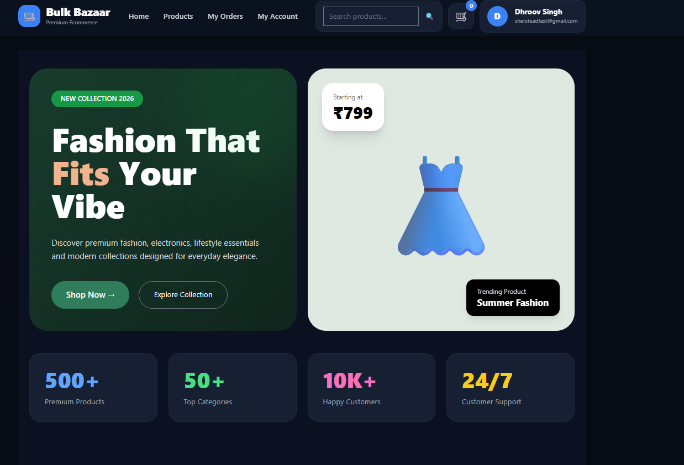
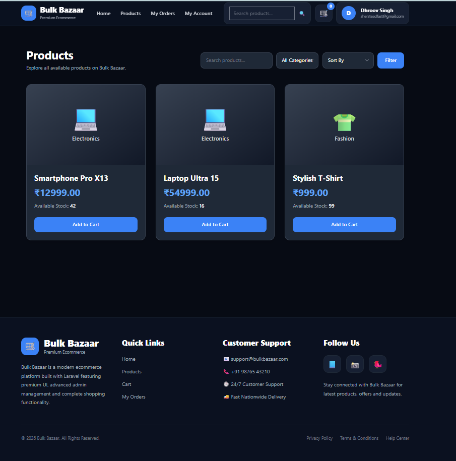
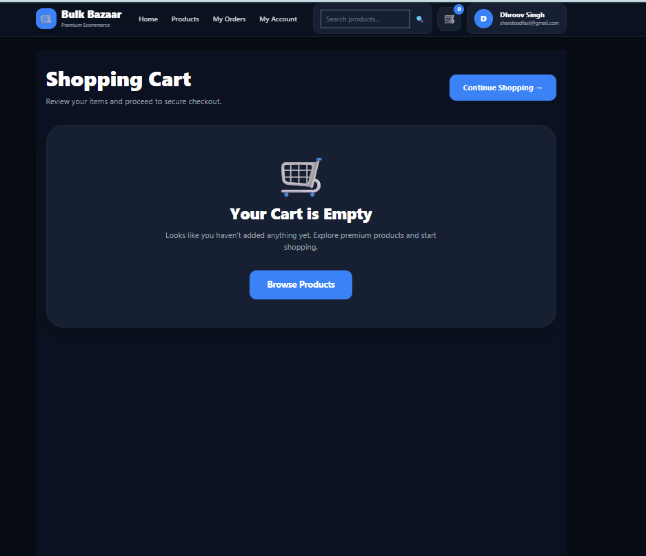
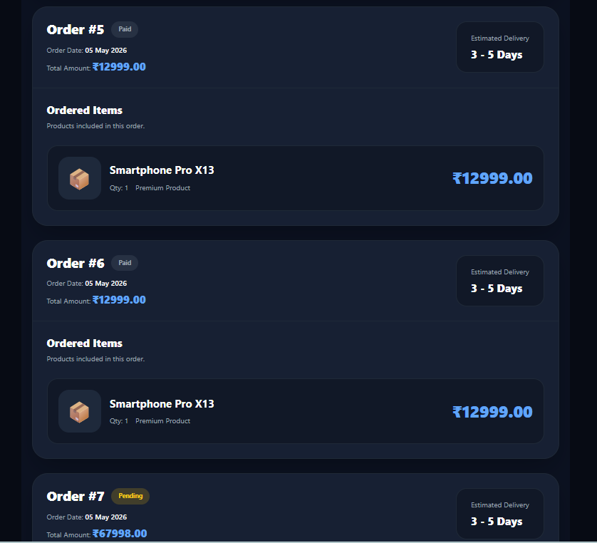
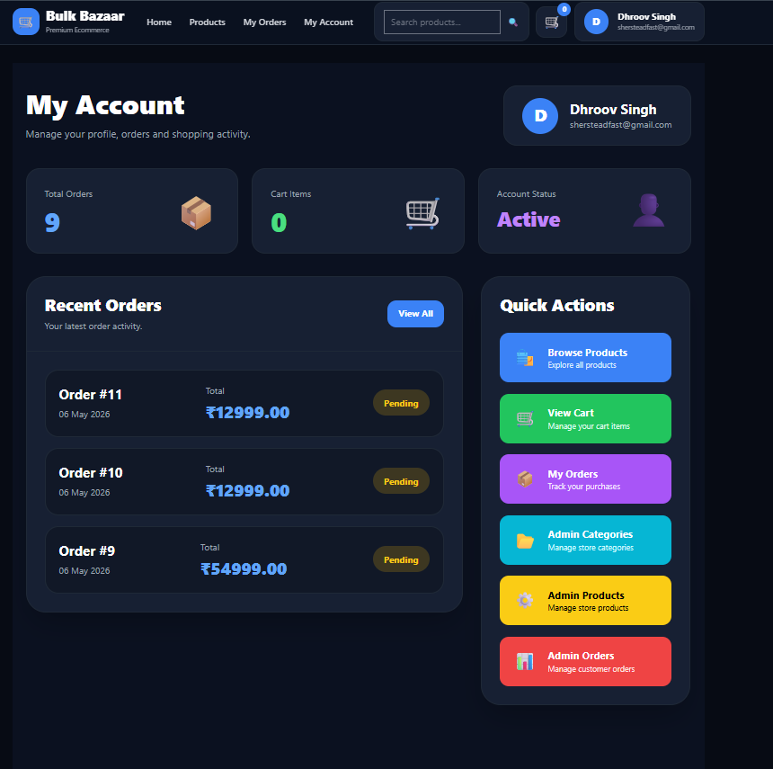
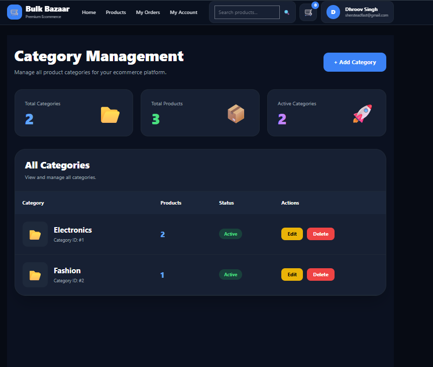
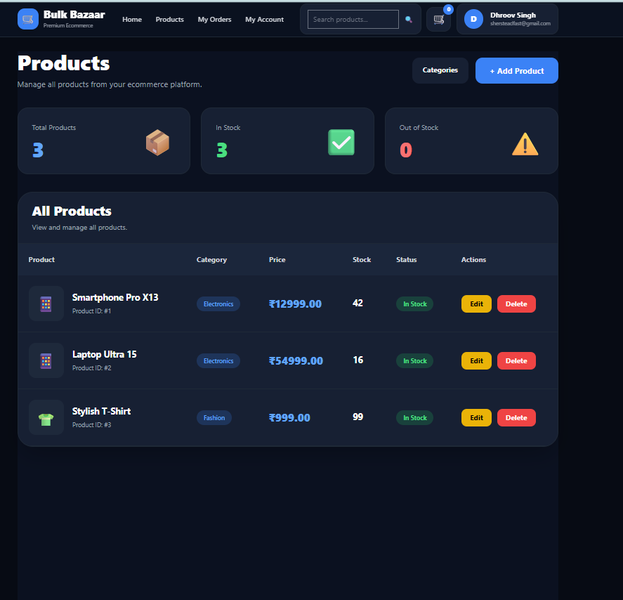

<p align="center"><a href="https://laravel.com" target="_blank"></a></p>

<p align="center">
<a href="https://github.com/laravel/framework/actions"></a>
<a href="https://packagist.org/packages/laravel/framework"></a>
<a href="https://packagist.org/packages/laravel/framework"></a>
<a href="https://packagist.org/packages/laravel/framework"></a>
</p>

## About Laravel

Laravel is a web application framework with expressive, elegant syntax. We believe development must be an enjoyable and creative experience to be truly fulfilling. Laravel takes the pain out of development by easing common tasks used in many web projects, such as:

- [Simple, fast routing engine](https://laravel.com/docs/routing).
- [Powerful dependency injection container](https://laravel.com/docs/container).
- Multiple back-ends for [session](https://laravel.com/docs/session) and [cache](https://laravel.com/docs/cache) storage.
- Expressive, intuitive [database ORM](https://laravel.com/docs/eloquent).
- Database agnostic [schema migrations](https://laravel.com/docs/migrations).
- [Robust background job processing](https://laravel.com/docs/queues).
- [Real-time event broadcasting](https://laravel.com/docs/broadcasting).

Laravel is accessible, powerful, and provides tools required for large, robust applications...

## Learning Laravel:

Laravel has the most extensive and thorough [documentation](https://laravel.com/docs) and video tutorial library of all modern web application frameworks, making it a breeze to get started with the framework.

You may also try the [Laravel Bootcamp](https://bootcamp.laravel.com), where you will be guided through building a modern Laravel application from scratch.

If you don't feel like reading, [Laracasts](https://laracasts.com) can help. Laracasts contains over 2000 video tutorials on a range of topics including Laravel, modern PHP, unit testing, and JavaScript. Boost your skills by digging into our comprehensive video library.

## Laravel Sponsors:

We would like to extend our thanks to the following sponsors for funding Laravel development. If you are interested in becoming a sponsor, please visit the Laravel [Patreon page](https://patreon.com/taylorotwell).

### Premium Partners

- **[Vehikl](https://vehikl.com/)**
- **[Tighten Co.](https://tighten.co)**
- **[Kirschbaum Development Group](https://kirschbaumdevelopment.com)**
- **[64 Robots](https://64robots.com)**
- **[Cubet Techno Labs](https://cubettech.com)**
- **[Cyber-Duck](https://cyber-duck.co.uk)**
- **[Many](https://www.many.co.uk)**
- **[Webdock, Fast VPS Hosting](https://www.webdock.io/en)**
- **[DevSquad](https://devsquad.com)**
- **[Curotec](https://www.curotec.com/services/technologies/laravel/)**
- **[OP.GG](https://op.gg)**
- **[WebReinvent](https://webreinvent.com/?utm_source=laravel&utm_medium=github&utm_campaign=patreon-sponsors)**
- **[Lendio](https://lendio.com)**

## Contributing

Thank you for considering contributing to the Laravel framework! The contribution guide can be found in the [Laravel documentation](https://laravel.com/docs/contributions).

## Code of Conduct

In order to ensure that the Laravel community is welcoming to all, please review and abide by the [Code of Conduct](https://laravel.com/docs/contributions#code-of-conduct)...

## Security Vulnerabilities

If you discover a security vulnerability within Laravel, please send an e-mail to Taylor Otwell via [taylor@laravel.com](mailto:taylor@laravel.com). All security vulnerabilities will be promptly addressed.

## License

The Laravel framework is open-sourced software licensed under the [MIT license](https://opensource.org/licenses/MIT).


# 🛒 Bulk Bazaar

<div align="center">

### Premium Full Stack Ecommerce Platform

Modern ecommerce web application built using Laravel, Tailwind CSS, Blade, and MySQL.


</div>

---

# ✨ Overview:

Bulk Bazaar is a modern ecommerce platform inspired by premium enterprise ecommerce systems.

The application includes:
- Customer storefront
- Product browsing
- Category filtering
- Shopping cart
- Checkout system
- Order management
- Inventory tracking
- Admin dashboard
- Product/category CRUD
- Responsive premium UI

The project focuses on complete frontend + backend ecommerce workflow implementation using Laravel MVC architecture.

---

# 🚀 Features

## 👤 Customer Features

- Premium homepage UI
- Hero slider section
- Shop by Category section
- Product listing page
- Product details page
- Search functionality
- Category filters
- Price sorting
- Add to Cart system
- Quantity management
- Checkout workflow
- Order history page
- Responsive navigation

---

## ⚙️ Admin Features

- Admin dashboard
- Product CRUD operations
- Category CRUD operations
- Order management
- Order status updates
- Inventory management
- Real-time backend synchronization
- Responsive admin interface

---

# 🧰 Tech Stack

| Technology | Usage |
|------------|-------|
| Laravel | Backend Framework |
| PHP | Server-side Development |
| Blade | Frontend Templating |
| Tailwind CSS | UI Styling |
| MySQL | Database |
| Git & GitHub | Version Control |
| XAMPP | Local Development |

---

# 📸 Screenshots

## 🏠 Homepage



---

## 🛍️ Products Page



---

## 🛒 Shopping Cart



---

## 📦 Order Management



---

## ⚙️ Admin Dashboard



---

## 🗂️ Category Management



---

## ✏️ Product Management



---

# 🔄 Workflow

## Customer Flow

1. Browse Products
2. Search & Filter Products
3. View Product Details
4. Add Products to Cart.
5. Checkout
6. View Orders

---

## Admin Flow

1. Add/Edit/Delete Products
2. Manage Categories.
3. Manage Orders
4. Update Order Status
5. Track Inventory

---

# 💡 Key Highlights

- Full-stack ecommerce workflow.
- Modern responsive UI
- Backend-connected dynamic system
- Inventory reduction logic
- User-specific order management
- Role-based admin access
- Professional admin dashboard
- Enterprise-inspired design.

---

# 📂 Project Structure

```plaintext
app/
resources/
routes/
database/
public/
screenshots/
```

---

# ⚡ Installation

```bash
git clone https://github.com/Dhroovs/Bulk_Bazaar.git
```

```bash
cd Bulk_Bazaar
```

```bash
composer install
```

```bash
npm install
```

```bash
cp .env.example .env
```

```bash
php artisan key:generate
```

```bash
php artisan migrate
```

```bash
php artisan serve
```

---

# 👨‍💻 Developer

## Dhroov Singh

Full Stack Laravel Ecommerce Project.

---

# ⭐ Conclusion:

Bulk Bazaar demonstrates a complete ecommerce ecosystem with premium frontend design, backend integration, dynamic CRUD operations, order workflows, and responsive admin management.

The project reflects practical implementation of Laravel MVC architecture and modern ecommerce application development.

---

<div align="center">

### ⭐ If you like this project, consider giving it a star ⭐

</div>
