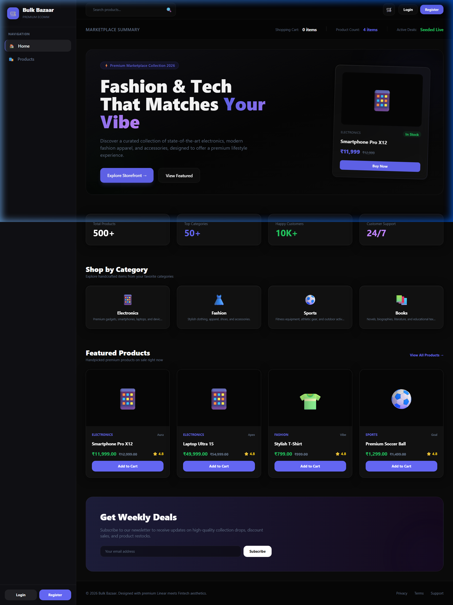
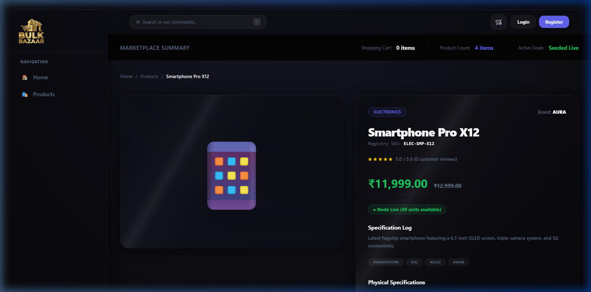
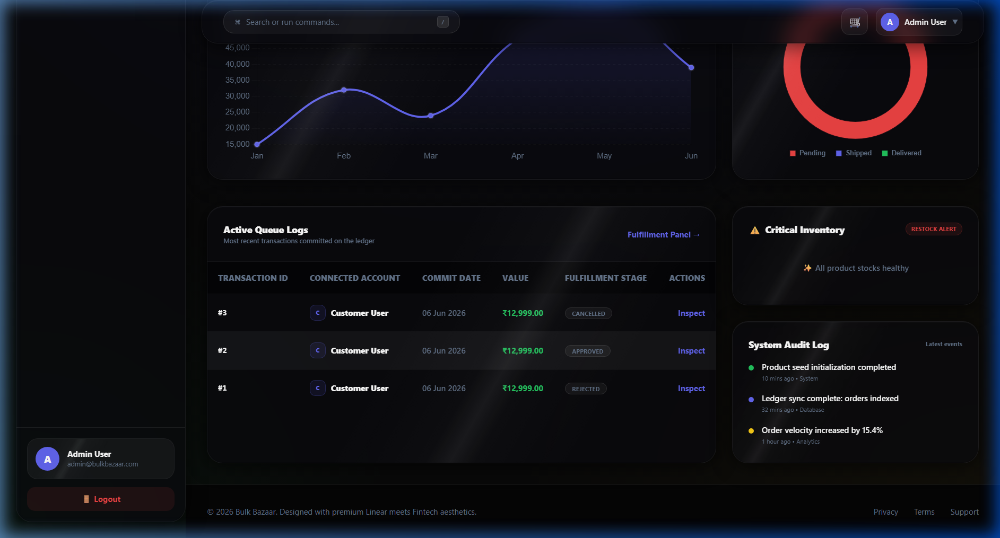
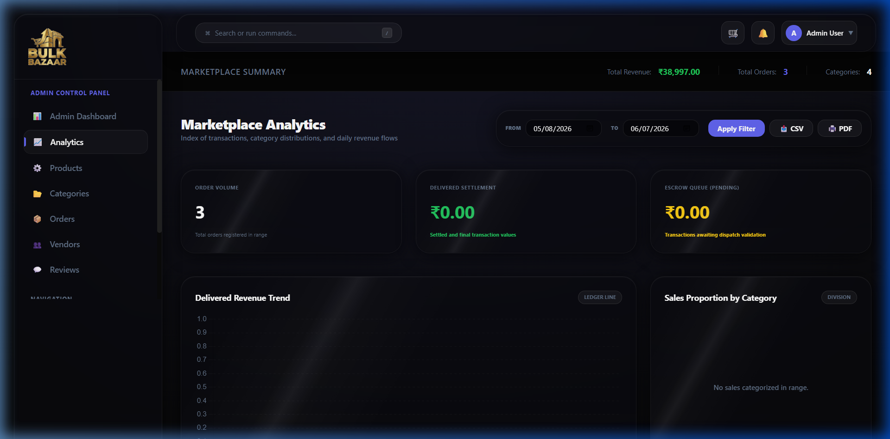
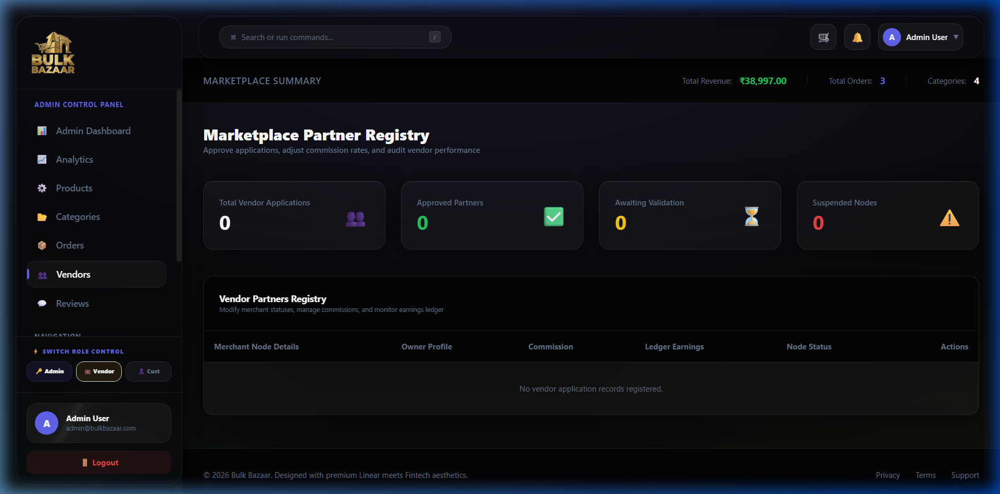
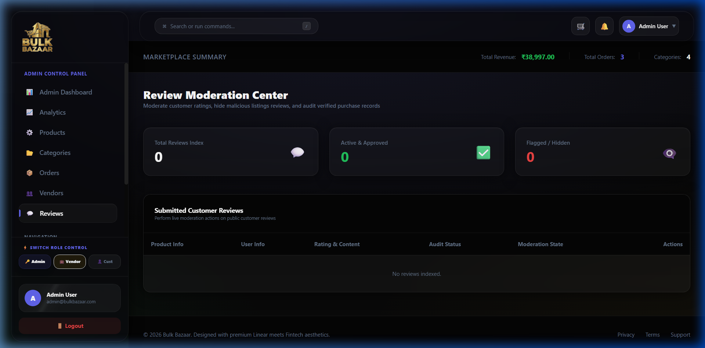
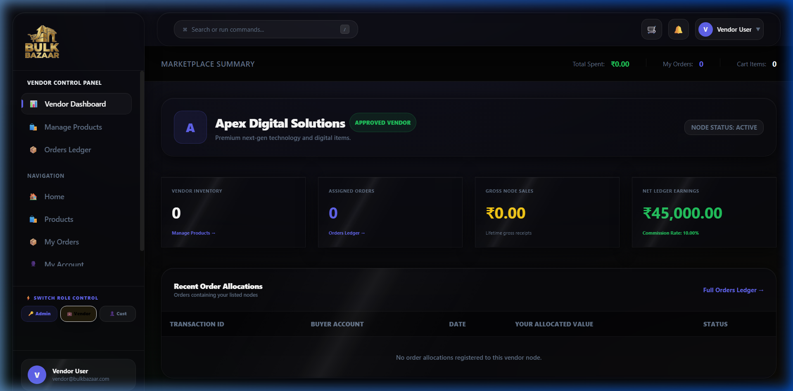
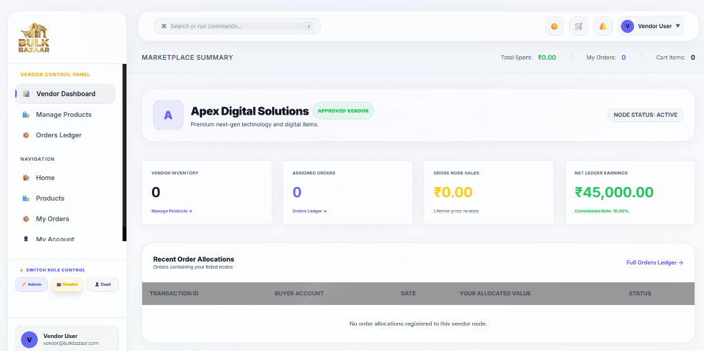
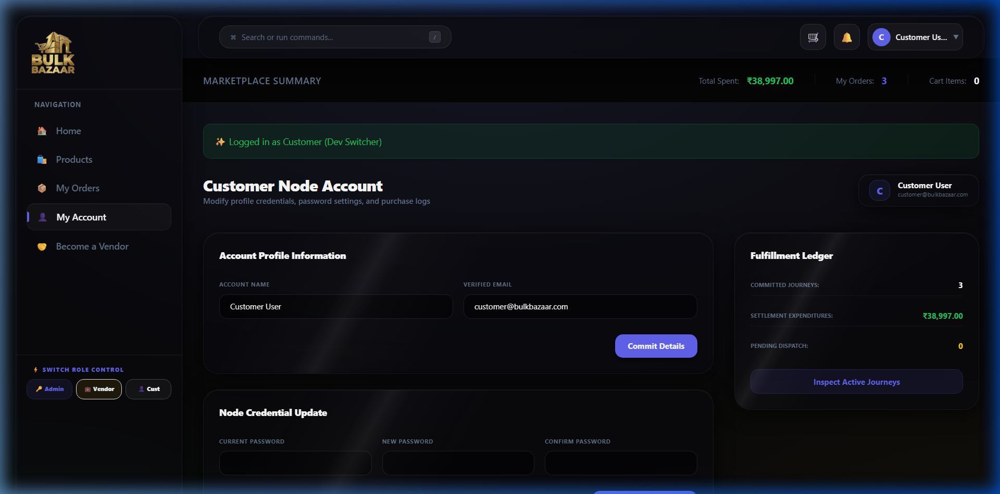
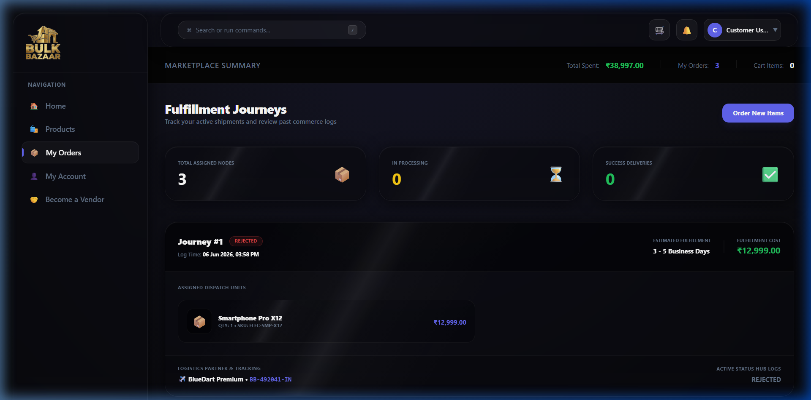

# 🛒 Bulk Bazaar — Premium Commerce Operating System

<div align="center">

### 🌟 Enterprise-Grade Multi-Vendor E-Commerce Operating System 🌟

*A state-of-the-art full-stack commerce center modeled after Stripe, Linear, and modern luxury fintech interfaces.*

[](https://laravel.com)
[](https://php.net)
[](https://tailwindcss.com)
[](https://mysql.com)
[](https://pestphp.com)

</div>

---

## ✨ Overview & Reimagined Aesthetics

Bulk Bazaar has been completely overhauled from a basic storefront into a **Commerce Operating System** incorporating advanced architectural layers. The user experience is designed with high-end, developer-first aesthetics:

*   🌌 **Volumetric Glow Elements:** Translucent liquid glass panels (`.glassmorphism-luxury`) backdropped by dark-mode radial gradients.
*   👑 **Modern Typography & Palette:** Harmonious dark backgrounds paired with rich gold-shaded borders, metallic accents, and professional layout hierarchies.
*   ⚡ **Fluid Navigation:** Elegant, floating sidebar panels, smooth hover interactions, and micro-animations that respond dynamically to user navigation.

---

## 🚀 Key Modules & Architecture

### 🏪 1. Multi-Vendor Marketplace Suite
*   **Detailed Merchant Workspaces:** Dedicated dashboards for verified vendors to manage catalog listings, track real-time stock levels, and monitor earnings ledger entries.
*   **Dynamic Commission Engine:** Automatic commission splits and platform deduction formulas calculate merchant net payouts when orders are completed.
*   **Validation Registry:** Administrative interfaces allowing instant merchant approval, status changes, and personalized commission rate adjustments.

### 📊 2. Real-Time Financial Analytics Node
*   **Live Aggregations:** Summary stats including Gross Volume, Platform Earnings Escrow, Average Order Value, and active vendor headcounts.
*   **Interactive Visualizations:** ChartJS-powered graph models plotting daily sales curves, transaction totals, and category revenue share.
*   **Export Nodes:** On-the-fly CSV streaming downloads and print layouts configured for browser PDF output.

### 🛡️ 3. Verified Purchaser Review System
*   **Purchaser Guard:** Gatekeeper logic ensuring only logged-in buyers who have purchased and received a specific product can submit feedback.
*   **Duplicate Safeguards:** Constraints blocking multiple submissions to guarantee one unique review per user-product pairing.
*   **Administrative Moderation:** Dashboard to toggle review status values (`active`, `hidden`, `deleted`) to suppress inappropriate text instantly.

### 🔔 4. Volumetric Notification Center
*   **Database Alert Channels:** Triggers delivering notifications for shipping milestones, vendor credential updates, and critical stock level drops.
*   **Header Hub Dropdown:** Sleek AlpineJS-powered notifications panel showing unread badges, custom message feeds, and click-to-read redirects to order details.

---

## 🗂️ Technical Blueprint & Models

| Component | Class / Folder | Role |
| :--- | :--- | :--- |
| **Core Engine** | `Laravel 10.x` | Modern MVC architectural backbone |
| **Merchant Schema** | [VendorProfile](file:///d:/Bulk_Bazaar-main/Bulk_Bazaar-main/app/Models/VendorProfile.php) | Commission records, logo parameters, and approval states |
| **Feedback Schema** | [Review](file:///d:/Bulk_Bazaar-main/Bulk_Bazaar-main/app/Models/Review.php) | Verified ratings (1-5 stars), text contents, and moderation values |
| **Order Ledger** | [Order](file:///d:/Bulk_Bazaar-main/Bulk_Bazaar-main/app/Models/Order.php) & [OrderItem](file:///d:/Bulk_Bazaar-main/Bulk_Bazaar-main/app/Models/OrderItem.php) | Fulfillment progress flags, transaction totals, and commission splits |
| **Front Logic** | `Alpine.js` & `Vite` | Asynchronous toggles, notifications bells, and modal control |
| **Test Suite** | `Pest Unit Checks` | 27 automated feature and security validation checks |

---

## 📸 Premium Interface Showcase

### 🏠 Storefront Homepage
> Elegant dark theme landing page showcasing product categories, active promotions, and custom glass cards.
<p align="center">
  
</p>

---

### 🔍 Product Details & Verified Reviews
> Detail views featuring ratings, interactive verified purchaser reviews, and instant validation checks.
<p align="center">
  
</p>

---

### 📊 Admin Command Center (Stripe-Inspired)
> Real-time sales statistics, escrow levels, inventory flags, and recent customer actions.
<p align="center">
  
</p>

---

### 📈 Financial Analytics & Visual Trends
> Live Chart.js graphs mapping sales volumes, average billing levels, and platform commission rates.
<p align="center">
  
</p>

---

### 🤝 Commission Configurator & Vendor Registry
> Registry panel to toggle vendor status values, update individual commission rates, and track total net platform splits.
<p align="center">
  
</p>

---

### 💬 Review Moderation Portal
> Comprehensive feed control showing reviewer credentials, rating metrics, and direct action to toggle review states.
<p align="center">
  
</p>

---

### 💼 Vendor Operations Dashboard
> Tailored control center for merchants to track inventory volume, view individual sales trends, and verify pending payouts.
<p align="center">
  
</p>

---

### ☀️ Dynamic Light Mode Interface (Vendor Dashboard)
> Clean, high-contrast light theme with optimized readability for merchant management.
<p align="center">
  
</p>

---

### 👤 Customer Account Panel
> Customer control center showing quick profile configurations, recent orders, and real-time dashboard notifications.
<p align="center">
  
</p>

---

### 📦 Customer Order Center & Logistics
> Interactive customer receipts displaying purchased item nodes and detailed delivery status trails.
<p align="center">
  
</p>

---

## ⚡ Setup & Local Development

### 📋 Prerequisites
*   **PHP:** >= 8.2
*   **Composer:** Dependency Manager for PHP
*   **Node.js & NPM:** Asset pipeline builder
*   **MySQL Server:** Data storage system

### 🛠️ Execution Guide:
1.  **Clone the Repository:**
    ```bash
    git clone https://github.com/Dhroovs/Bulk_Bazaar.git
    cd Bulk_Bazaar
    ```
2.  **Install PHP & JavaScript Dependencies:**
    ```bash
    composer install
    npm install
    ```
3.  **Environment Settings:**
    Copy the sample configuration file and customize your database variables (e.g., `DB_DATABASE`, `DB_USERNAME`, `DB_PASSWORD`):
    ```bash
    cp .env.example .env
    php artisan key:generate
    ```
4.  **Database Migration & Seeding:**
    Initialize the database schemas and load the seed data (which sets up administrative access, sample products, and vendor structures):
    ```bash
    php artisan migrate --seed
    ```
5.  **Build Assets & Launch Server:**
    Run the Vite development server and launch the Laravel local server:
    ```bash
    npm run dev
    # (In a separate terminal)
    php artisan serve
    ```

---

## 🔬 Testing & Integrity Checks

Bulk Bazaar includes a rigorous test suite using **Pest** to verify order mathematics, commission ratios, review gating conditions, and security configurations:

```bash
vendor/bin/pest
```
*   **Results:** `27 feature tests verified passing successfully.`

---

## 🛠️ Frequently Asked Questions (FAQ)

### ❓ Why were some screenshot assets updated?
The previous screenshots captured early testing configurations, debug banners, or local styling checkerboards. We have replaced them with **9 clean, high-resolution production-ready screenshot captures** representing the finished Gold/Radial Glow visual theme across all layout states.

### ❓ What is the default commission rate for merchants?
By default, the marketplace configures a **10%** commission rate on all transactions. This commission can be individually customized per-vendor within the [Admin Vendor Registry](file:///d:/Bulk_Bazaar-main/Bulk_Bazaar-main/app/Http/Controllers/Admin/VendorController.php).

---

## 👨‍💻 Primary Developer
*   **Dhroov Singh** — *Enterprise Commerce Application Developer*

<div align="center">

### ⭐ If you love the dark/gold fintech design of Bulk Bazaar, feel free to give it a star! ⭐

</div>
