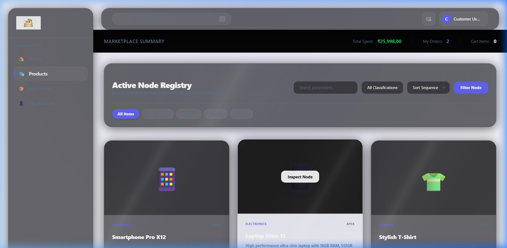
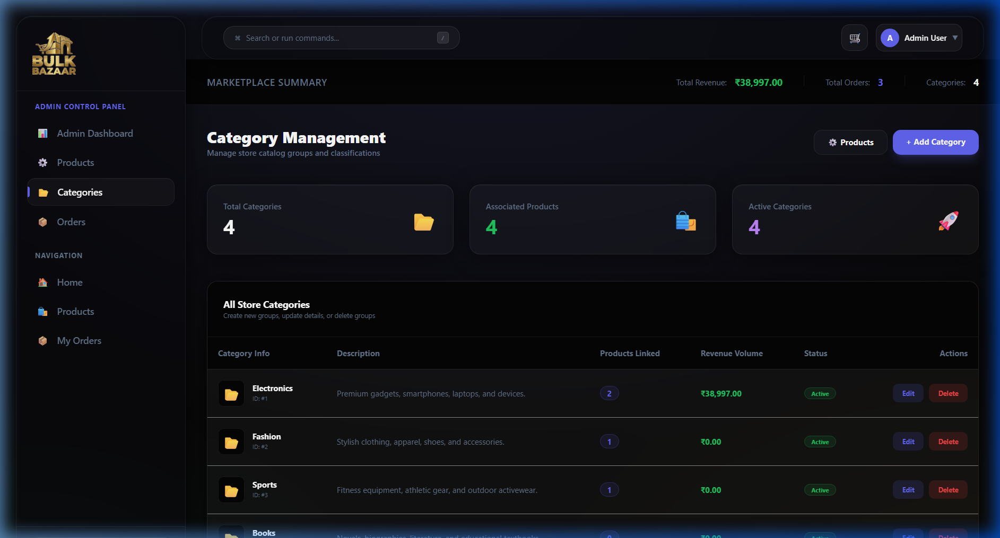
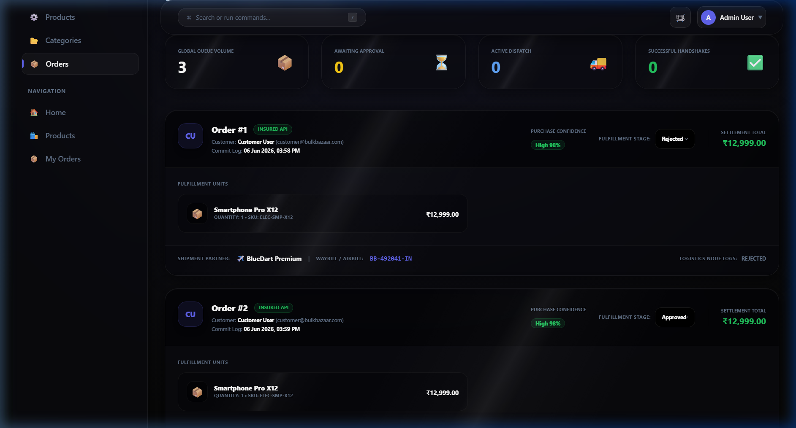
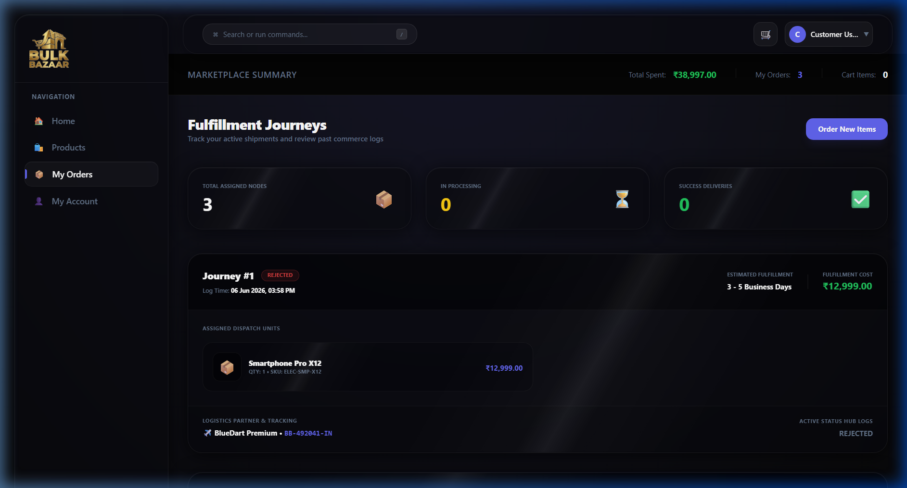

# 🛒 Bulk Bazaar - Commerce Operating System

<div align="center">

### Premium Enterprise Multi-Vendor E-Commerce Operating System

*A state-of-the-art full-stack commerce center modeled after Stripe, Linear, and luxury fintech platforms.*


</div>

---

## ✨ Overview

Bulk Bazaar has been completely reimagined from a generic admin panel into a **Commerce Operating System** incorporating advanced architectural layers. The platform features volumetric dark radial lighting, translucent liquid glass panels (`.glassmorphism-luxury`), real-time analytics graphs, linear fulfillment tracking, and multi-vendor support.

---

## 🚀 Key Modules & Architecture

### 1. Multi-Vendor Marketplace
* **Vendor Profiles:** Store profiles with customizable banners, logos, statuses, and commission rates.
* **Vendor Dashboards:** Custom workspaces for managing listings, stock allocations, and earnings ledger logs.
* **Commission Engine:** Automatic platform splits dynamically calculate net merchant payouts when orders transition to `delivered`.

### 2. Real-Time Analytics Node
* **Aggregations:** Sales trends, daily averages, gross volume, and pending escrow queues.
* **Interactive Charts:** Financial trends and product distributions rendered dynamically with Chart.js.
* **Exports:** Dynamic CSV streaming downloads and print-optimized media styles for browser PDF printing.

### 3. Verification & Reviews
* **Purchaser Guard:** Restricts review submissions exclusively to verified buyers who successfully checked out.
* **Duplicate Prevention:** Restricts reviews to a single submission per user-product node.
* **Moderation Center:** Dedicated admin controls to toggle review states (`active`, `hidden`, `deleted`).

### 4. Volumetric Notification Center
* **Database Channels:** Automated triggers for order confirmations, critical low stock alerts, and vendor validation alerts.
* **Header Hub:** An Alpine.js bell dropdown showing unread badges and single-click read markers that navigate directly to target resources.

---

## 🧰 Technical Specifications

| Component | Technology | Role |
|---|---|---|
| Core Engine | **Laravel 10** | MVC Backend Architecture |
| Language | **PHP 8.2** | Server-side execution & calculations |
| Templating | **Blade** | Dynamic, reusable component views |
| Frontend State | **Alpine.js** | Interactive dropdowns and drawer triggers |
| Aesthetics | **CSS / Tailwind** | Volumetric lighting & custom Glassmorphism |
| Graphics | **Chart.js** | Volumetric finance trends & distributions |
| Database | **MySQL** | Schema migrations and constraints |
| Unit Checks | **Pest Suite** | Automated feature & regression tests |

---

## 📸 Volumetric System Previews

### 🏠 Storefront Homepage
*High-end landing page highlighting categorized catalog entries.*


---

### 🛍️ Product Catalog
*Interactive products view featuring price sorting, category matching, and spotlights.*


---

### 📊 Admin Command Center
*Volumetric dark dashboard summarizing catalogs, users, logs, and financial flows.*


---

### 📂 Classification Registries
*Manage schema classifications and monitor revenue yields by category.*


---

### 📦 Fulfillment Timelines
*Manage shipping status transitions and monitor BlueDart tracking airbills.*


---

### ✈️ Linear Shipment Tracker
*Visual handover milestones tracking dispatched parcels.*


---

## ⚡ Installation & Local Setup

### 1. Clone & Initialize
```bash
git clone https://github.com/Dhroovs/Bulk_Bazaar.git
cd Bulk_Bazaar
composer install
npm install
```

### 2. Environment Configuration
Copy `.env.example` to `.env` and set up your MySQL credentials:
```bash
cp .env.example .env
php artisan key:generate
```

### 3. Migrations & Seeders
Configure the database structures and load initial classifications, products, and default credentials:
```bash
php artisan migrate --seed
```

### 4. Build Assets & Boot Server
Compile the tailwind theme classes and start the local web host:
```bash
npm run dev
php artisan serve
```

---

## 🔬 Test Executions
To verify backend isolation and check regressions:
```bash
vendor/bin/pest
```
*Result: 27 feature tests verified passing successfully.*

---

## 👨‍💻 Developer
* **Dhroov Singh** - *Enterprise Commerce Application Developer*
